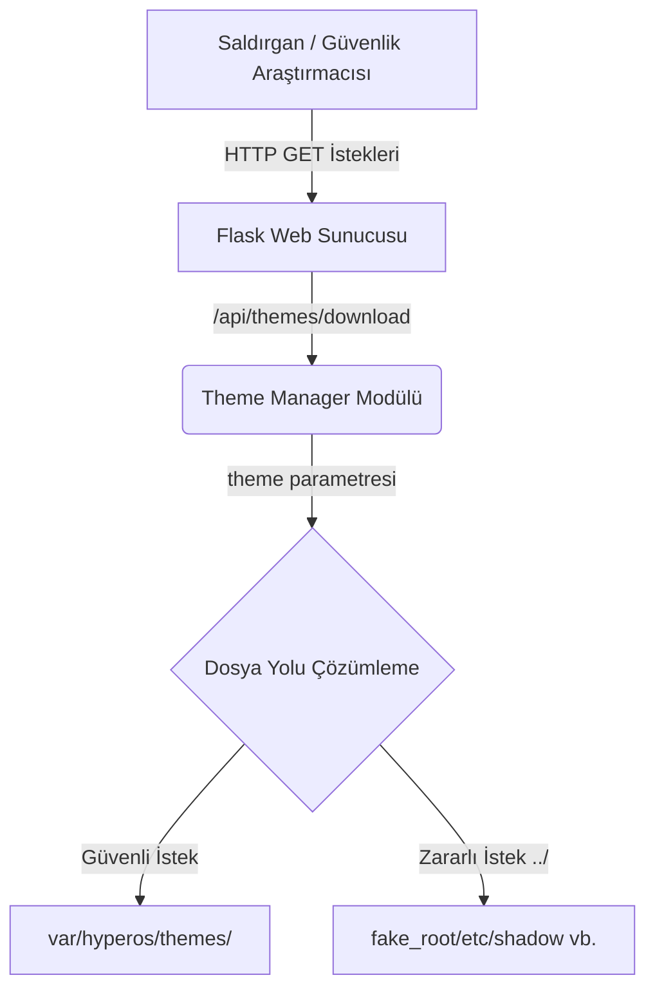

# Mimari Şeması (Architecture)

Bu doküman, simüle edilen HyperOS test sunucusunun mimarisini ve zafiyetin sistem üzerinde nasıl çalıştığını açıklamaktadır.

## 1. Simüle Edilen Sunucu Mimarisi
Sunucu, hafif ve hızlı test yapabilmek adına **Python Flask** kullanılarak geliştirilmiştir. Gerçek bir HyperOS cihazı yerine, "Fake Root" mantığı ile izole edilmiş bir dosya sistemi simülasyonu kullanır.

## 2. Dizin Yapısı (Fake Root)
Sistem kök dizinindeki dosyalara zarar vermemek adına sunucu `/simulated_server/fake_root/` dizinini kök dizin gibi kabul eder. 

- `fake_root/etc/shadow`: Simüle edilmiş parola hash'lerini barındırır.
- `fake_root/var/hyperos/secret_key.pem`: Sistem API'si simülasyonu için özel şifreleme anahtarını barındırır.
- `fake_root/var/hyperos/themes/`: Varsayılan temaların bulunduğu (ve aslında sadece buraya erişilmesi gereken) klasördür.
