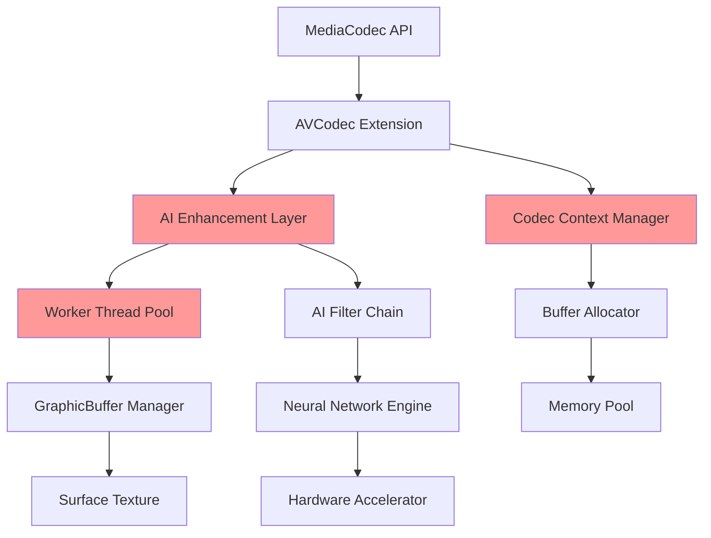
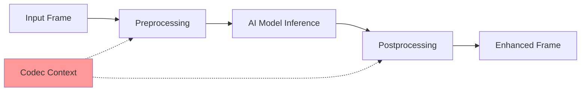

# HyperOS AVCodec Architecture Analysis

## System Architecture Overview

The HyperOS AVCodec framework extends Android's standard MediaCodec with AI-enhanced processing capabilities, introducing additional complexity and attack surfaces.

## Component Architecture



## Vulnerability Points

### 1. AVCodec Extension Layer
- **Component**: Codec Context Manager
- **Issue**: Non-blocking release mechanism
- **Impact**: UAF when worker threads access freed contexts

### 2. AI Enhancement Layer  
- **Component**: Async callback system
- **Issue**: Race condition in filter chain
- **Impact**: Heap corruption through AI processing

### 3. Worker Thread Pool
- **Component**: Frame processing threads
- **Issue**: Insufficient synchronization
- **Impact**: Concurrent access to freed memory

## Data Flow Analysis

### Normal Operation Flow
```
1. MediaCodec API Request
2. AVCodec Extension Processing
3. AI Enhancement Application
4. Worker Thread Dispatch
5. Frame Processing
6. Buffer Management
7. Surface Texture Update
```

### Vulnerable Flow (UAF Trigger)
```
1. Codec Context Creation
2. Worker Thread Spawn
3. AI Filter Chain Setup
4. [RACE CONDITION WINDOW]
5. Context Release (Main Thread)
6. Frame Processing (Worker Thread) ← UAF HERE
7. Memory Corruption
8. Potential RCE
```

## Memory Management Architecture

### Heap Layout
```
┌─────────────────┐
│   CodecContext  │ ← Target for UAF
├─────────────────┤
│   Buffer Pool   │
├─────────────────┤
│   AI Metadata   │
├─────────────────┤
│  GraphicBuffer  │ ← Grooming target
└─────────────────┘
```

### Thread Synchronization Model
```cpp
// Current (Vulnerable) Model
class AVCodecContext {
    std::thread worker_thread_;
    std::atomic<bool> released_{false};
    
    void release() {
        released_ = true;
        // NO thread.join() - VULNERABILITY!
        delete this;
    }
};

// Secure Model (Patched)
class AVCodecContext {
    std::thread worker_thread_;
    std::mutex context_mutex_;
    std::condition_variable cv_;
    
    void release() {
        {
            std::lock_guard<std::mutex> lock(context_mutex_);
            released_ = true;
        }
        cv_.notify_all();
        worker_thread_.join(); // PATCH: Wait for completion
        delete this;
    }
};
```

## AI Enhancement Layer Details

### Neural Network Integration


### Filter Chain Architecture
```cpp
class AIFilterChain {
    std::vector<std::unique_ptr<AIFilter>> filters_;
    CodecContext* context_; // VULNERABLE: Raw pointer
    
    void processAsync(Frame* frame) {
        // UAF risk: context_ may be freed during processing
        for (auto& filter : filters_) {
            filter->process(frame, context_); // Dangling pointer access
        }
    }
};
```

## Attack Surface Analysis

### Primary Attack Vectors

1. **Media File Processing**
   - Malicious video/audio files
   - Crafted codec parameters
   - Timing-based race conditions

2. **AI Enhancement APIs**
   - Filter chain manipulation
   - Neural network model injection
   - Callback function overrides

3. **Surface Texture Management**
   - Buffer lifecycle manipulation
   - Graphics memory corruption
   - Display pipeline exploitation

### Secondary Attack Vectors

1. **IPC Communication**
   - Binder interface exploitation
   - Service process targeting
   - Permission escalation

2. **Hardware Acceleration**
   - GPU memory management
   - Hardware codec exploitation
   - Firmware interface attacks

## Security Boundaries

### Process Isolation
```
┌─────────────────────────────────────┐
│           System Server             │
├─────────────────────────────────────┤
│         Media Server Process        │
│  ┌─────────────────────────────┐    │
│  │      AVCodec Service        │    │ ← Vulnerability here
│  │  ┌─────────────────────┐    │    │
│  │  │   AI Enhancement    │    │    │
│  │  └─────────────────────┘    │    │
│  └─────────────────────────────┘    │
├─────────────────────────────────────┤
│         Application Process         │
└─────────────────────────────────────┘
```

### Privilege Escalation Path
1. **Initial Access**: Application-level media processing
2. **Vulnerability Trigger**: UAF in AVCodec service
3. **Privilege Escalation**: Media server process compromise
4. **System Impact**: Potential system-level access

## Mitigation Architecture

### Proposed Security Enhancements

1. **Reference Counting**
```cpp
class SafeCodecContext {
    std::shared_ptr<CodecContext> context_;
    std::weak_ptr<CodecContext> worker_ref_;
    
    void processAsync() {
        auto ctx = context_.lock();
        if (ctx) {
            // Safe access with shared ownership
            ctx->processFrame();
        }
    }
};
```

2. **Thread Synchronization**
```cpp
class SynchronizedCodec {
    std::mutex context_mutex_;
    std::condition_variable worker_cv_;
    std::atomic<int> active_workers_{0};
    
    void safeRelease() {
        std::unique_lock<std::mutex> lock(context_mutex_);
        worker_cv_.wait(lock, [this] { 
            return active_workers_ == 0; 
        });
        // Now safe to release
    }
};
```

3. **Memory Safety**
```cpp
// Use smart pointers and RAII
using CodecPtr = std::unique_ptr<CodecContext>;
using BufferPtr = std::shared_ptr<MediaBuffer>;

class MemorySafeCodec {
    CodecPtr context_;
    std::vector<BufferPtr> buffers_;
    
    // Automatic cleanup on destruction
    ~MemorySafeCodec() = default;
};
```