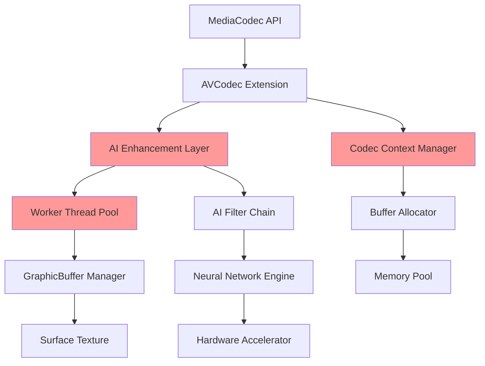
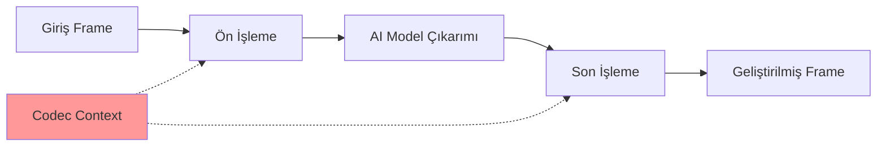

# HyperOS AVCodec Mimari Analizi

## Sistem Mimarisi Genel Bakış

HyperOS AVCodec framework'ü, Android'in standart MediaCodec'ini AI-geliştirilmiş işleme yetenekleri ile genişletmekte ve ek karmaşıklık ile saldırı yüzeyleri sunmaktadır.

## Bileşen Mimarisi



## Zafiyet Noktaları

### 1. AVCodec Extension Layer
- **Bileşen**: Codec Context Manager
- **Sorun**: Non-blocking release mekanizması
- **Etki**: Worker thread'ler serbest bırakılmış context'lere eriştiğinde UAF

### 2. AI Enhancement Layer  
- **Bileşen**: Asenkron callback sistemi
- **Sorun**: Filter chain'de race condition
- **Etki**: AI işleme yoluyla heap bozulması

### 3. Worker Thread Pool
- **Bileşen**: Frame işleme thread'leri
- **Sorun**: Yetersiz senkronizasyon
- **Etki**: Serbest bırakılmış belleğe eşzamanlı erişim

## Veri Akışı Analizi

### Normal Operasyon Akışı
```
1. MediaCodec API İsteği
2. AVCodec Extension İşleme
3. AI Enhancement Uygulaması
4. Worker Thread Dağıtımı
5. Frame İşleme
6. Buffer Yönetimi
7. Surface Texture Güncellemesi
```

### Zafiyetli Akış (UAF Tetikleyici)
```
1. Codec Context Oluşturma
2. Worker Thread Başlatma
3. AI Filter Chain Kurulumu
4. [RACE CONDITION PENCERESİ]
5. Context Release (Ana Thread)
6. Frame İşleme (Worker Thread) ← UAF BURADA
7. Bellek Bozulması
8. Potansiyel RCE
```

## Bellek Yönetimi Mimarisi

### Heap Düzeni
```
┌─────────────────┐
│   CodecContext  │ ← UAF hedefi
├─────────────────┤
│   Buffer Pool   │
├─────────────────┤
│   AI Metadata   │
├─────────────────┤
│  GraphicBuffer  │ ← Grooming hedefi
└─────────────────┘
```

### Thread Senkronizasyon Modeli
```cpp
// Mevcut (Zafiyetli) Model
class AVCodecContext {
    std::thread worker_thread_;
    std::atomic<bool> released_{false};
    
    void release() {
        released_ = true;
        // thread.join() YOK - ZAFİYET!
        delete this;
    }
};

// Güvenli Model (Yamalı)
class AVCodecContext {
    std::thread worker_thread_;
    std::mutex context_mutex_;
    std::condition_variable cv_;
    
    void release() {
        {
            std::lock_guard<std::mutex> lock(context_mutex_);
            released_ = true;
        }
        cv_.notify_all();
        worker_thread_.join(); // YAMA: Tamamlanmayı bekle
        delete this;
    }
};
```

## AI Enhancement Layer Detayları

### Neural Network Entegrasyonu


### Filter Chain Mimarisi
```cpp
class AIFilterChain {
    std::vector<std::unique_ptr<AIFilter>> filters_;
    CodecContext* context_; // ZAFİYETLİ: Ham pointer
    
    void processAsync(Frame* frame) {
        // UAF riski: context_ işleme sırasında serbest bırakılabilir
        for (auto& filter : filters_) {
            filter->process(frame, context_); // Dangling pointer erişimi
        }
    }
};
```

## Saldırı Yüzeyi Analizi

### Birincil Saldırı Vektörleri

1. **Medya Dosyası İşleme**
   - Kötü amaçlı video/ses dosyaları
   - Hazırlanmış codec parametreleri
   - Zamanlama tabanlı race condition'lar

2. **AI Enhancement API'leri**
   - Filter chain manipülasyonu
   - Neural network model enjeksiyonu
   - Callback fonksiyon geçersiz kılmaları

3. **Surface Texture Yönetimi**
   - Buffer yaşam döngüsü manipülasyonu
   - Grafik bellek bozulması
   - Display pipeline sömürüsü

### İkincil Saldırı Vektörleri

1. **IPC İletişimi**
   - Binder arayüz sömürüsü
   - Servis süreci hedefleme
   - İzin yükseltme

2. **Donanım Hızlandırma**
   - GPU bellek yönetimi
   - Donanım codec sömürüsü
   - Firmware arayüz saldırıları

## Güvenlik Sınırları

### Süreç İzolasyonu
```
┌─────────────────────────────────────┐
│           System Server             │
├─────────────────────────────────────┤
│         Media Server Process        │
│  ┌─────────────────────────────┐    │
│  │      AVCodec Service        │    │ ← Zafiyet burada
│  │  ┌─────────────────────┐    │    │
│  │  │   AI Enhancement    │    │    │
│  │  └─────────────────────┘    │    │
│  └─────────────────────────────┘    │
├─────────────────────────────────────┤
│         Application Process         │
└─────────────────────────────────────┘
```

### Yetki Yükseltme Yolu
1. **İlk Erişim**: Uygulama seviyesi medya işleme
2. **Zafiyet Tetikleme**: AVCodec servisinde UAF
3. **Yetki Yükseltme**: Media server süreci tehlikede
4. **Sistem Etkisi**: Potansiyel sistem seviyesi erişim

## Azaltma Mimarisi

### Önerilen Güvenlik Geliştirmeleri

1. **Referans Sayımı**
```cpp
class SafeCodecContext {
    std::shared_ptr<CodecContext> context_;
    std::weak_ptr<CodecContext> worker_ref_;
    
    void processAsync() {
        auto ctx = context_.lock();
        if (ctx) {
            // Paylaşılan sahiplik ile güvenli erişim
            ctx->processFrame();
        }
    }
};
```

2. **Thread Senkronizasyonu**
```cpp
class SynchronizedCodec {
    std::mutex context_mutex_;
    std::condition_variable worker_cv_;
    std::atomic<int> active_workers_{0};
    
    void safeRelease() {
        std::unique_lock<std::mutex> lock(context_mutex_);
        worker_cv_.wait(lock, [this] { 
            return active_workers_ == 0; 
        });
        // Artık serbest bırakmak güvenli
    }
};
```

3. **Bellek Güvenliği**
```cpp
// Akıllı pointer'lar ve RAII kullan
using CodecPtr = std::unique_ptr<CodecContext>;
using BufferPtr = std::shared_ptr<MediaBuffer>;

class MemorySafeCodec {
    CodecPtr context_;
    std::vector<BufferPtr> buffers_;
    
    // Yıkıcıda otomatik temizlik
    ~MemorySafeCodec() = default;
};
```